# 物流及运费模版设置

* [1 开启物流公司](#1)
* [2 运费模版](#2)
* [2.1 配置运费模版](#2.1)
* [2.1 自定义运费的运费模版](#2.1.1)
* [2.1.1.1 按重量计价的运费模版](#2.1.1.1)
* [2.1.1.2 按件数计价的运费模版](#2.1.1.2)
* [2.1.1.3 按金额计价的运费模版](#2.1.1.3)
* [2.1.2 卖家承担运费的运费模版](#2.1.2)
* [2.2 应用运费模版](#2.2)
* [2.3 修改运费模版](#2.3)

## <h2 id="1">开启物流公司</h2>

**商家可以使用平台提供的物流公司，开启物流公司后，商家可以在发货时选择开启的物流公司，并且可以进行物流跟踪。**

进入商家后台，在【交易】板块中的【物流公司】页面，可以看见平台方提供的物流公司，找到想要启用的物流公司，点击【开启该物流】，即可使用。

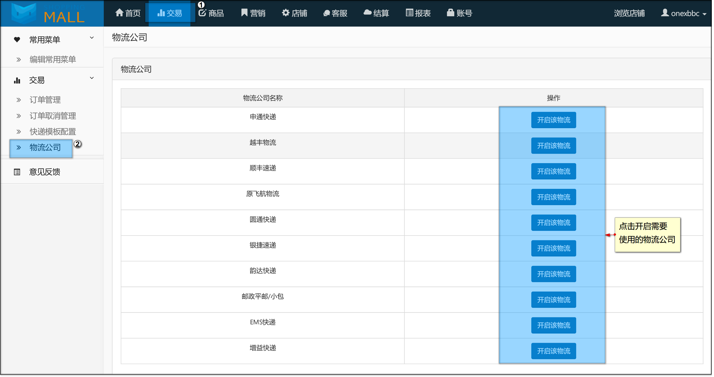

在开启的物流公司处点击【取消】，可以关闭物流公司。

发货时，可以选择开启的物流公司。

选择开启的物流公司发货后，可以查看物流跟踪（需要使用真实的运单号）。

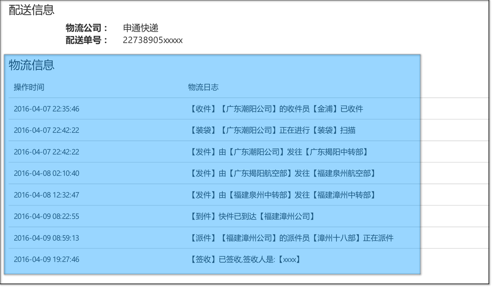

## <h2 id="2">运费模版</h2>

**商家可以对每件商品单独设置运费模版，运费模版在提供运费计价的同时还可设置包邮规则。**

### <h3 id="2.1">配置运费模版</h3>

商家可以在后台交易模块中的【快递模版配置】页面添加运费模版

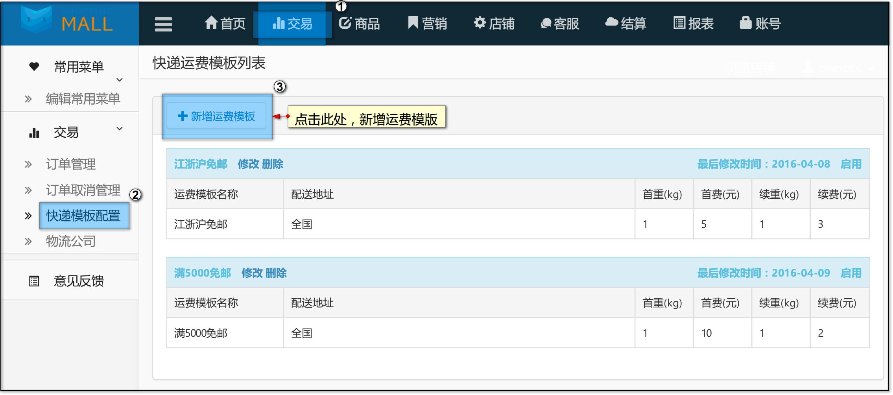

#### <h4 id="2.1.1">自定义运费的运费模版</h4>

自定义运费(客户承担运费)的运费模版提供三种计价方式：按重量计价、按件数计价、按金额计价

以下我们按不同的计价方式来绍运费模版的配置。

##### <h5 id="2.1.1.1">按重量计价的运费模版</h5>

按重量计价提供商品首重与续重运费设置，可以针对不同地区设置运费。

此种计价方式支持如下包邮条件：[【指定重量内包邮】](#2.1.1.1.1)、[【满足指定金额包邮】](#2.1.1.1.2)、[【指定重量内并且满足指定金额后包邮】](#2.1.1.1.3)

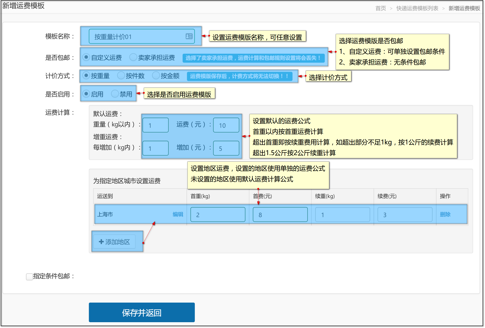

**包邮：**

<a id="2.1.1.1.1">指定重量内包邮</a>

<a id="2.1.1.1.2">满足指定金额包邮</a>

<a id="2.1.1.1.3">指定重量内并且满足指定金额后包邮</a>

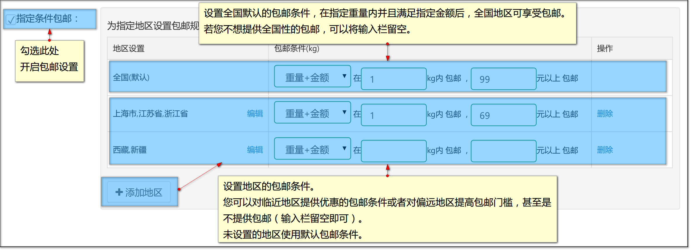

##### <h5 id="2.1.1.2">按件数计价的运费模版</h5>

按重量计价提供商品首件与续件运费设置，可以针对不同地区设置运费。

此种计价方式支持如下包邮条件：[【指定件数内包邮】](#2.1.1.2.1)、[【满足指定金额包邮】](#2.1.1.2.2)、[【指定件数内并且满足指定金额后包邮】](#2.1.1.2.3)

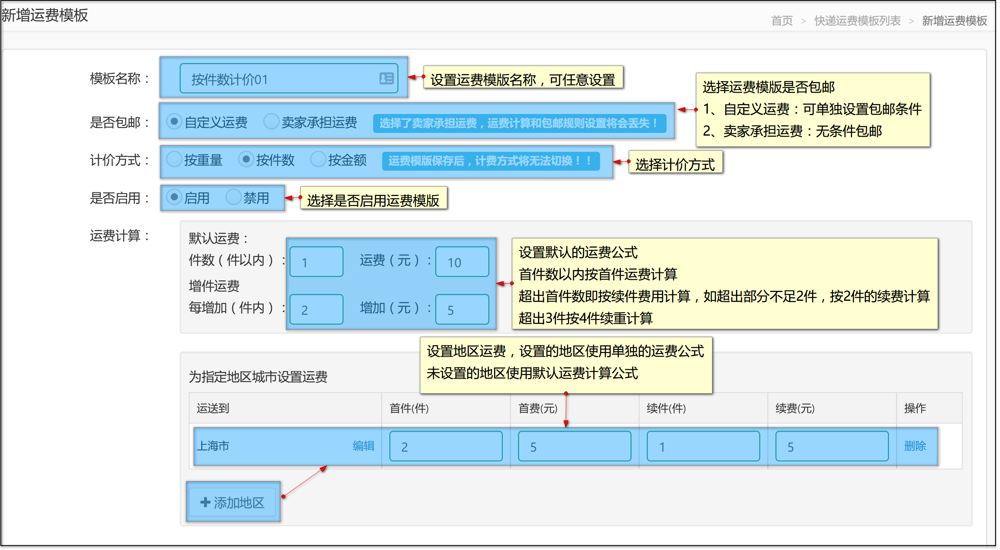

**包邮：**

<a id="2.1.1.2.1">指定件数内包邮</a>

<a id="2.1.1.2.2">满足指定金额包邮</a>

<a id="2.1.1.2.3">指定件数内并且满足指定金额后包邮</a>

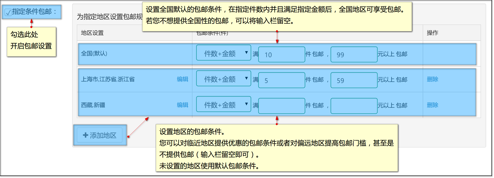

##### <h5 id="2.1.1.3">按金额计价的运费模版</h5>

按重量计价提供通过不同金额区间来设置对应运费。

此种计价方式无包邮条件配置，可以通过运费设置直接实现满金额免运费。

_ _ _

运费模版添加完后，列表页面会显示对应的运费列表

下图是各个计价方式的运费模版展示

#### <h3 id="2.1.2">卖家承担运费的运费模版</h3>

卖家承担运费，即此运费模版无条件包邮。

此类型的运费模版无需关联计价方式，所以计价方式可以随意选择，不过需要注意的是，由于运费模版保存后，无法在切换计价方式，所以当日后切换至【自定义运费】类型的运费模版时，模版只能使用的当时选择的计价方式！

PS：使用【卖家承担运费】类型的商品，前台商品详情页会出现‘卖家承担运费’的文字提示。

PC端显示

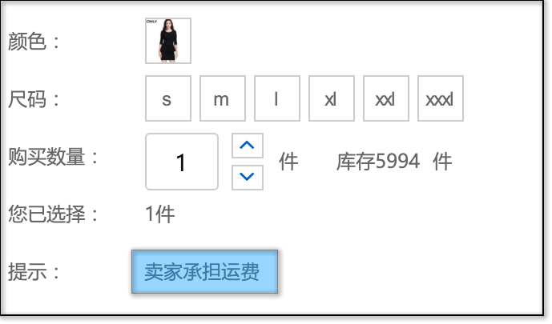

WAP端显示

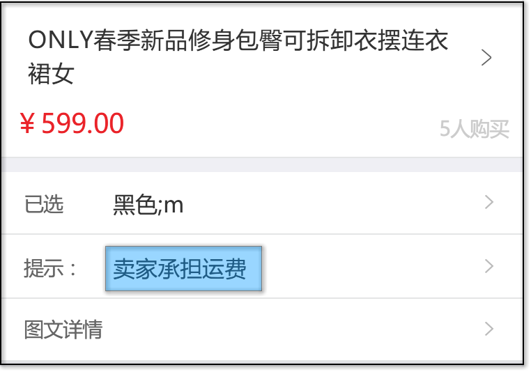

### <h3 id="2.2">应用运费模版</h3>

商家在发布商品时可以设置商品所使用的运费模版

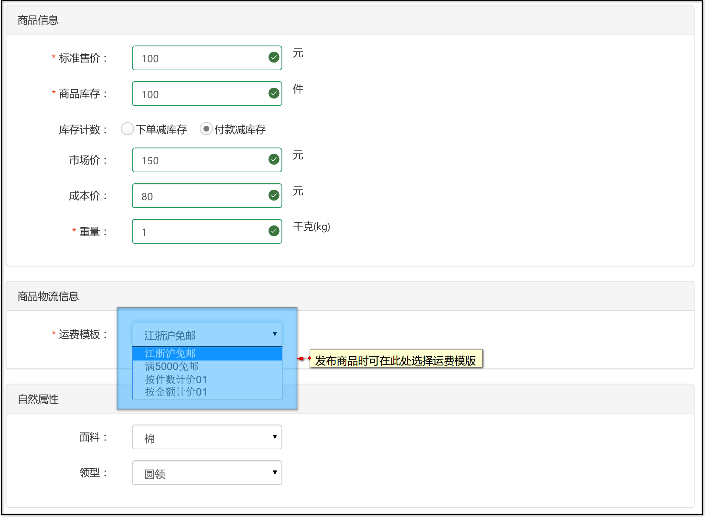

当需要更换商品的运费模版时，商家可以单独到每个商品中进行更换，也可以使用更快捷的批量更换。

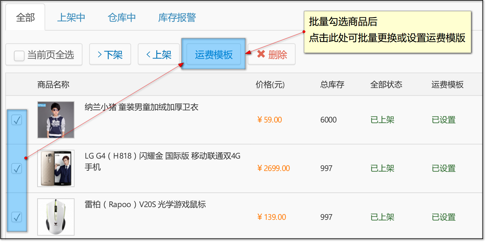

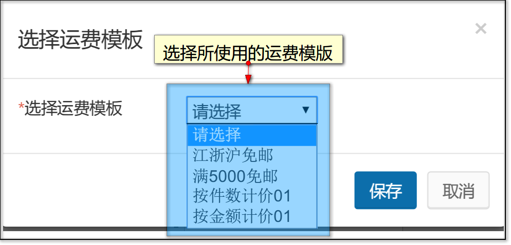

在商品列表页中，您可以通过【运费模版】筛选项来找到对应的商品。

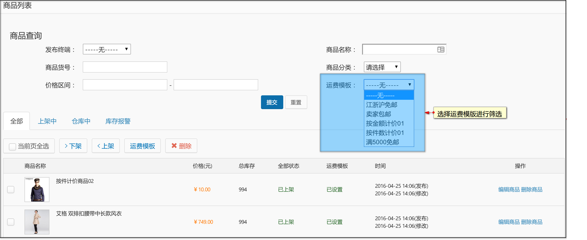

### <h3 id="2.3">修改运费模版</h3>

当商家需要调整某一运费模版时，可以去修改运费模版，运费模版的编辑项与新增时一致，可以参考【新增运费模版】

需要注意的是，已添加的运费模版不支持对计价方式进行修改！

### <h3 id="2.4">删除运费模版</h3>

当商家不需要某一运费模版时，可以选择删除此模版

如果某一模版当前正在被商品使用，是无法被删除的，请先解除运费模版与商品的绑定关系。

