# 商品管理

* [1 商品发布及维护](#1)
* [1.1 产品信息](#1.1)
* [1.2 基本内容](#1.2)
* [1.3 商品信息](#1.3)
* [1.4 自然属性](#1.4)
* [1.5 详细参数](#1.5)
* [1.6 销售属性&商品规格](#1.6)
* [1.7 商品描述](#1.7)
* [1.8 是否显示原价](#1.8)
* [2 店铺分类](#2)
* [3 商品列表](#3)
* [4 库存报警](#4)
* [5 商品上架审核](#5)
* [6 商品导出、导入](#6)
* [6.1 商品导出](#6.1)
* [6.2 商品导入](#6.2)

店铺最重要的就是管理和维护商家的商品，该小节介绍的是店铺商品管理与维护

## <h2 id="1">商品发布及维护</h2>

在商家管理页面点击发布商品进入添加商品页面

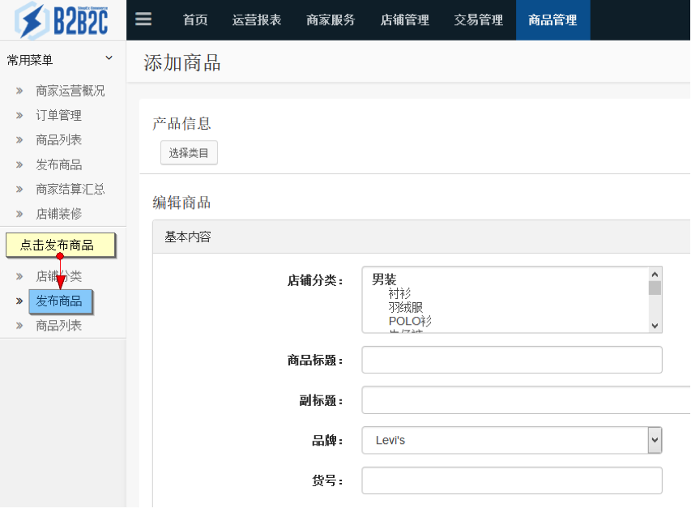

### <h3 id="1.1">产品信息</h3>

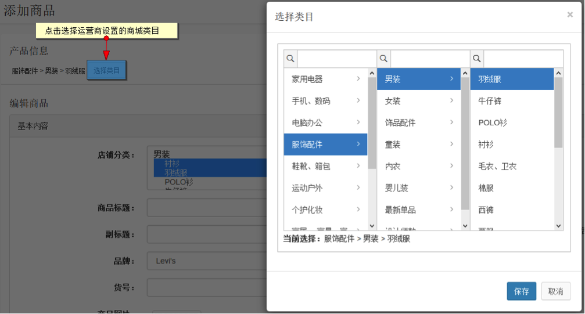

选择运营商预设的商城类目，选择后保存
      
### <h3 id="1.2">基本内容</h3>

基本内容包含了商品分类，标题，副标题，品牌，货号，商品图片

### <h3 id="1.3">商品信息</h3>

      
> 标准售价：商品销售价格
> 商品数量：商品销售库存
> 减库存时机：分为下单后，付款后，根据减库存时机来扣减库存
> 市场价：商品市场价
> 成本价：设置商品的成本价格
> 重量：商品重量，设置后会影响商品运费
> 排序：商品在列表页排序

### <h3 id="1.4">自然属性</h3>

选择运营商分类关联的自然属性

### <h3 id="1.5">详细参数</h3>

添加运营商设置的商品参数，在商品详情页显示

### <h3 id="1.6">销售属性&商品规格</h3>

勾选需要的规格点击生成货品

生成后的货品单独设置销售价，库存，商家编码，条形码

### <h3 id="1.7">商品描述</h3>

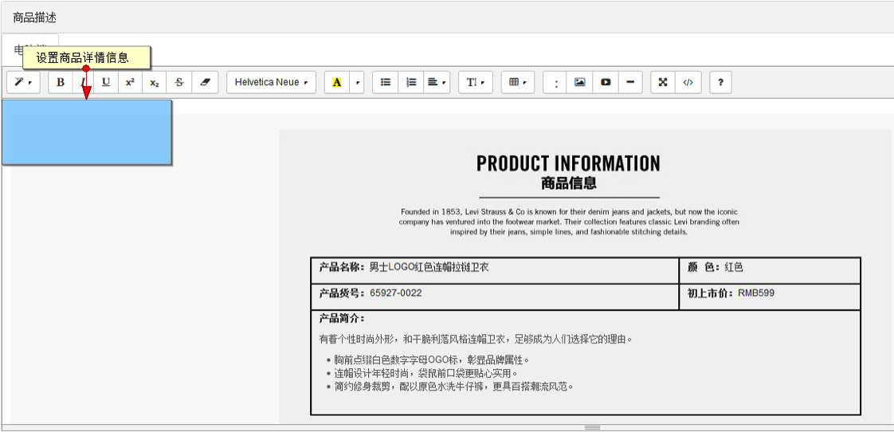

设置商品描述，用于商品详情页展示

### <h3 id="1.8">是否显示原价</h3>

您可以选择是否让【原价】显示在商品的详情页。

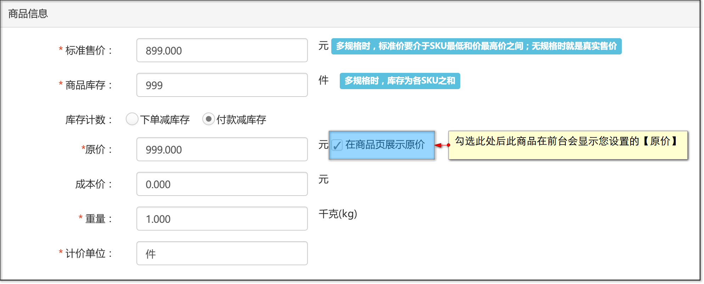

原价显示效果

PC端

WAP端

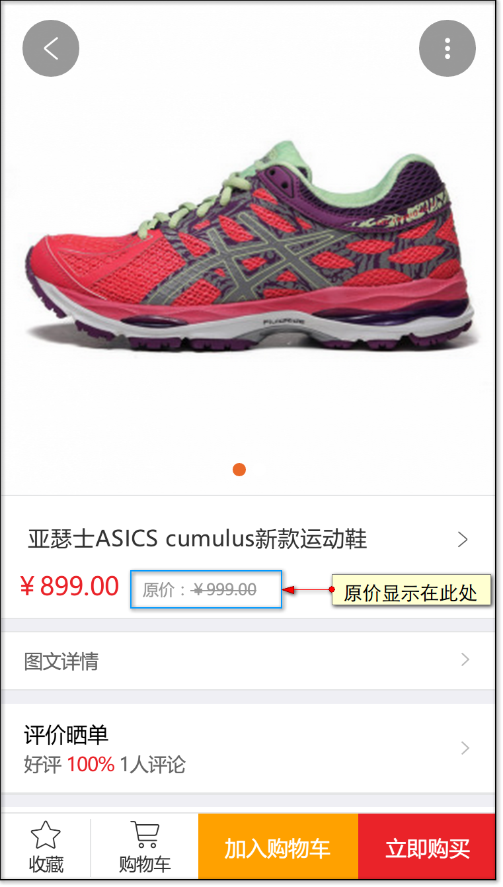

## <h2 id="2">店铺分类</h2>

商家店铺分类是商家用于商品分类展示用的商品类型

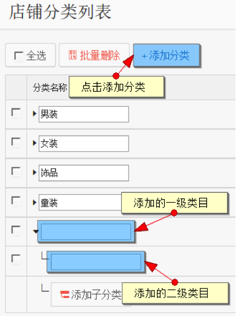

店铺分类深度为二级，且店铺名称不可重名

## <h2 id="3">商品列表</h2>

商品列表是展示商家商品信息，可进行批量上下架，删除操作，并且可以进行商品编辑操作

## <h2 id="4">库存报警</h2>

如果您想即时了解那些商品面临缺货的状况，可以通过设置【库存报警】来管理这些库存紧缺的商品

在商品模版-商品库存报警中，您可以设置【库存报警】数量，当商品的库存小于等于此数量时，就会被预警。

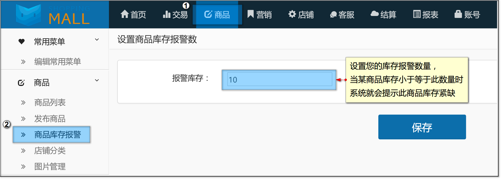

您可以访问商品列表中的【库存报警】标签，此处会成列出所有库存紧缺的商品。

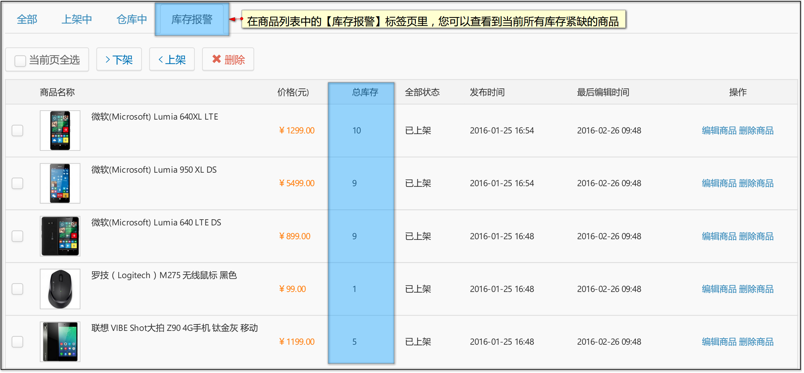

每当您登录管理平台，平台首页就会展示当前库存报警的数量，方便您即时了解库存状态；点击【库存报警量】更会直接进入【库存报警】标签页，方便您即时管理缺货商品。

## <h2 id="5">商品上架审核</h2>

当运营平台开启了商品审核功能后，您发布的商品都必须通过平台方审核方能上架（开启功能前已上架的商品不受影响）。

你可以在商品列表中查看到【审核】按钮，勾选您需要上架的商品，点击【审核】按钮，便完成了提交审核的操作。

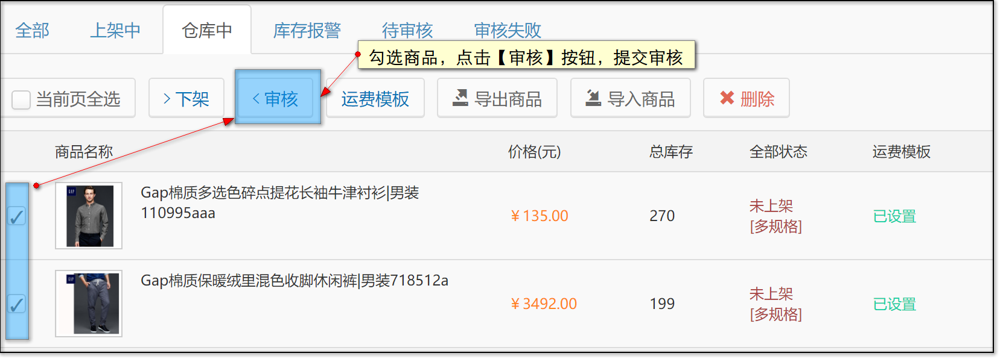

提交审核后，您可以在【待审核】标签页中查看到当前正在审核中的商品，您可在此页面跟踪审核进度，审核通过的商品会自动上架。

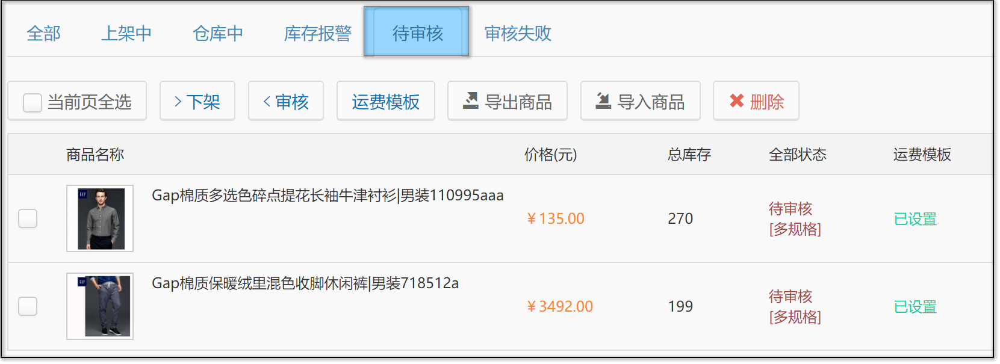

如果有商品被不幸驳回，您可在【审核失败】标签页中查看到他们，点击【编辑商品】可在商品编辑页查看管理员的驳回原因

驳回原因显示在编辑页的底部，您可根据具体原因修改商品信息后，重新发布提交审核。

## <h2 id="6">商品导出、导入</h2>

### <h2 id="6.1">商品导出</h2>

在商品列表的【全部】标签页，点击【导出商品】按钮，可以导出您目前店铺中的全部商品。

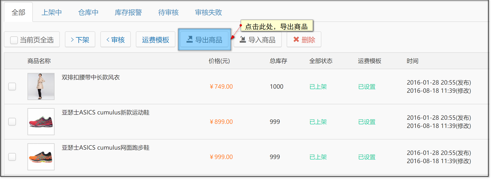

商品导出以每100个商品为一组，系统会自动分组，点击分组按钮便会进行导出的文件下载，导出的文件格式为xls。

如果您不希望导出全部的商品，而是针对性的导出，可以结合搜索条件或者标签页筛选来进行导出。

在进行筛选之后，导出的商品便是您筛选的结果。

### <h2 id="6.2">商品导入</h2>

在商品列表，点击【导入商品】按钮，页面会弹出导入界面，在此界面您可以通过下载某个三级分类的商品模板文档，按规则填充相关字段，并导入该文档，以完成商品信息批量导入。

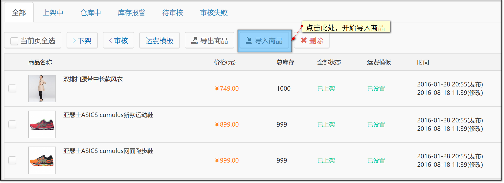

首先您需要下载对应的商品模版，点击界面中的【商品模版下载】会展开类目选择，系统会列出您的店铺所绑定的平台类目，选择一个三级类目，点击【下载】按钮，即可下载模版。

下载的模版文件格式为xls，建议使用office execl打开编辑，以下我们使用体验数据的‘连衣裙’分类模版为例：

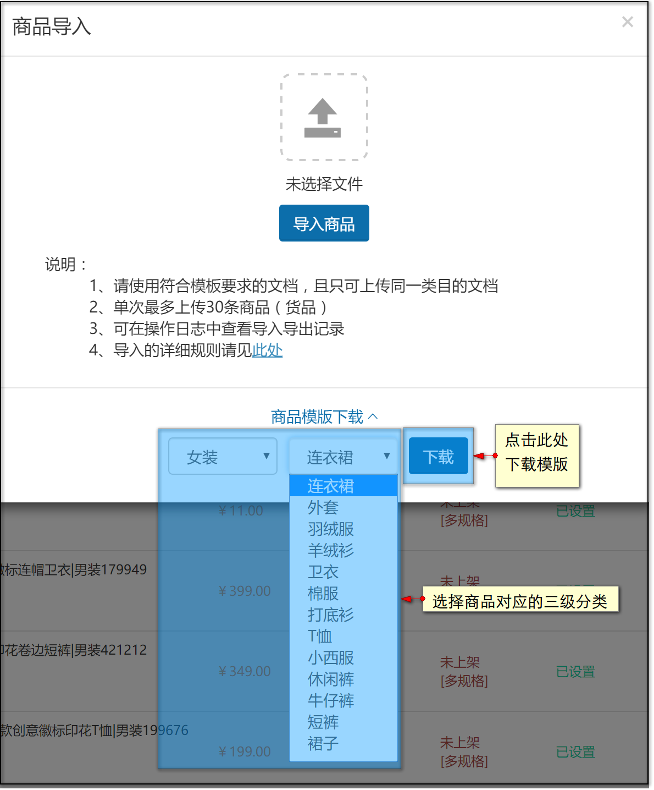

打开下载的得到的xls文件，文件中已经列出‘连衣裙’分类所包含的商品信息字段。您可在字段下方开始添加您的商品，单个文件最多添加30条商品（含sku）。

*PS:如果您使用的是execl，在添加完商品数据后，建议全选表格清除一下格式，以防止保存时有多余的格式，导致导入文件不成功。*

**各个字段的具体具体格式说明请详见下表：**

**示例展示：**

生成完商品导入文件后，点击导入界面中的按钮，选择上传您的商品文件，上传完毕即可点击【导入商品】按钮完成导入操作。

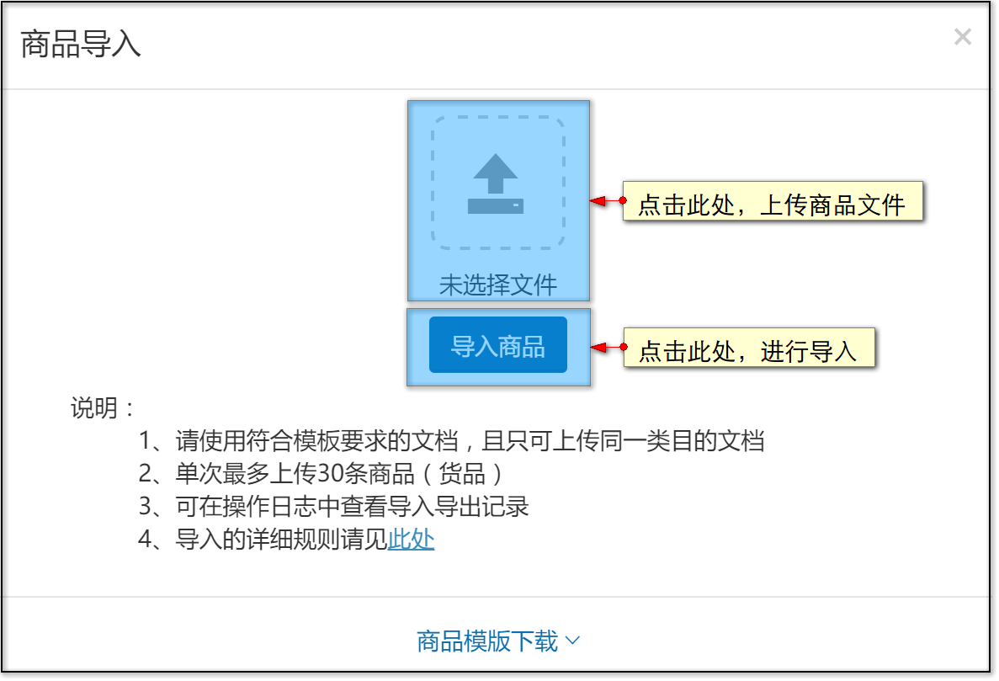

